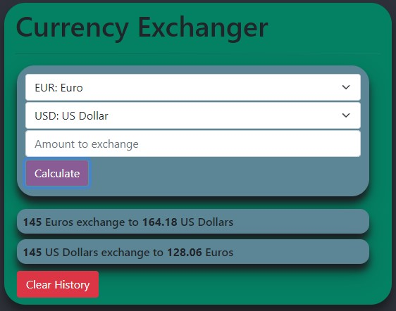

## Currency Exchanger

By Hannah Young

A simple currency exchange calculator using exchange rates sourced from the [ExchangeRate-API](https://www.exchangerate-api.com/).

### Technologies Used
* HTML
* CSS (including Bootstrap)
* JavaScript
* Node.js

### Description

This website showcases my ability to develop and deploy a website that utilizes data from an API. The calculator allows a user to calculate the current value of their currency into any other currency offered by ExchangeRate-API.

The website is visible on [GitHub Pages](https://Corgibyte.github.io/currency-exchanger/).

### Setup
1. Download and install [Git](http://git-scm.com)
2. Follow the instructions at [ExchangeRate-API](https://www.exchangerate-api.com/) to acquire a key
3. Use terminal to navigate to desired parent directory and use `git clone https://github.com/Corgibyte/currency-exchanger`
4. Navigate into project directory: `cd currency-exchanger`
5. Install node.js modules: `npm install`
6. Use terminal to create a .env file, making sure to replace `YOURKEY` with the key you obtained above : `echo "API_KEY=YOURKEY" > .env`
6. Build project: `npm run build`
7. Open `dist/index.html` in your browser

### Known bugs: 
None at current time

### License

[Hippocratic License 2.1](https://github.com/Corgibyte/currency-exchanger/blob/main/LICENSE.md), Copyright 2021 Hannah Young.

### Credits

Data file with ISO 4217 currency codes obtained with permission from [Currency List](https://github.com/umpirsky/currency-list)